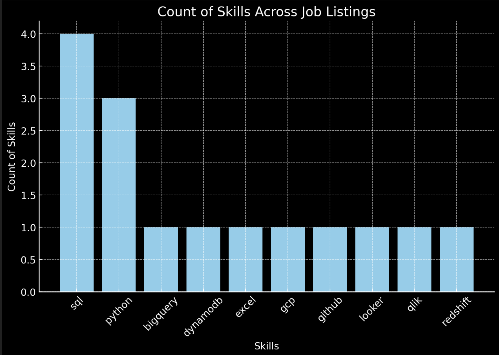

# Introduction
In this project I dived into the data job market, focused on data analyst roles, this project exploeres top paying jobs, in-demand skills and where high demand meets high salary in data analytics.

SQL queris? Check them out here: [project_sql folder]()
# Background
This project was born to find top-paid and in-demand skills, to focus and learn those skills.

Data and idea hails from Luke Barousse's website [SQL Course](https://www.lukebarousse.com/sql). It's packed with insights on job titles, salaries, locations, and essential skills.

The questions I wanted to answer through my SQL queries were:

1. What are the top-paying data analyst jobs?
2. What skills are required for these top-paying jobs?
3. What skills are most in demand for data analysts?
4. Which skills are associated with higher salaries?
5. What are the most optimal skills to learn?

# Tools I Used
For my deep dive into the data analyst job market, I harnessed the power of several key tools:

- SQL: The backbone of my analysis, allowing me to query the database and unearth critical insights.
- PostgreSQL: The chosen database management system, ideal for handling the job posting data.
- Visual Studio Code: My go-to for database management and executing SQL queries.
- Git & GitHub: Essential for version control and sharing my SQL scripts and analysis, ensuring collaboration and project tracking.
# The Analysis 
Each query for this project aimed at investigating specific aspects of the data analyst job market. Here’s how I approached each question:

### 1. Top Paying Data Analyst Jobs
To identify the highest-paying roles, I filtered data analyst positions by average yearly salary and location, focusing on remote jobs. This query highlights the high paying opportunities in the field.

```sql
SELECT 
    name AS company_name,
    job_id,
    job_title,
    job_location,
    job_schedule_type,
    salary_year_avg,
    job_posted_date

FROM
    job_postings_fact

LEFT JOIN company_dim ON job_postings_fact.company_id = company_dim.company_id

WHERE
    job_title_short = 'Data Analyst' AND
    job_location = 'Anywhere' AND
    salary_year_avg IS NOT NULL 

ORDER BY
    salary_year_avg DESC
LIMIT 100
```
Here's the breakdown of the top data analyst jobs in 2023:

- **Wide Salary Range:** Top 10 paying data analyst roles span from $184,000 to $650,000, indicating significant salary potential in the field.
- **Diverse Employers:** Companies like SmartAsset, Meta, and AT&T are among those offering high salaries, showing a broad interest across different industries.
- **Job Title Variety:** There's a high diversity in job titles, from Data Analyst to Director of Analytics, reflecting varied roles and specializations within data analytics.


Bar graph visualizing the salary for the top 10 salaries for data analysts; ChatGPT generated this graph from my SQL query results

### Top Paying Data Analyst Jobs For Turkey
| Company Name   | Job Title                               | Job Location            | Salary Year Avg ($) |
|----------------|-----------------------------------------|--------------------------|---------------------|
| Libertex Group | Data Architect (optional relocation to Montenegro) | İstanbul, Türkiye       | 163,782.0           |
| Robert Half    | Data Warehouse Analyst                  | Sancaktepe/İstanbul, Türkiye | 110,000.0           |
| VavaCars       | Senior Data Analyst                     | İstanbul, Türkiye       | 98,500.0            |
| Fugo Games     | Product Data Analyst                    | İstanbul, Türkiye       | 57,600.0            |
| Ace Games      | Data Analyst                            | İstanbul, Türkiye       | 57,500.0            |
| Fugo Games     | Product Data Analyst                    | İstanbul, Türkiye       | 50,400.0            |

Here we can see small portion of data analyst jobs from Turkey.
Which are 50,400₺/month minimum and 163,782₺/month maximum.

### 2. Skills for Top Paying Jobs

To understand what skills are required for the top-paying jobs, I joined the job postings with the skills data, providing insights into what employers value for high-compensation roles.

```sql
WITH top_paying_jobs AS (
    SELECT 
        name AS company_name,
        job_id,
        job_title,
        salary_year_avg,
        name AS company_name
    FROM
        job_postings_fact
    LEFT JOIN company_dim ON job_postings_fact.company_id = company_dim.company_id

    WHERE
        job_title_short = 'Data Analyst' AND
        job_location = 'Anywhere' AND
        salary_year_avg IS NOT NULL
    ORDER BY
        salary_year_avg DESC
    LIMIT 10
)


SELECT 
   COUNT(skills) AS count_of_skills,
   skills

FROM  top_paying_jobs

INNER JOIN skills_job_dim ON top_paying_jobs.job_id = skills_job_dim.job_id
INNER JOIN skills_dim ON skills_job_dim.skill_id = skills_dim.skill_id

GROUP BY
    skills

ORDER BY
count_of_skills DESC

LIMIT 10

```

Here's the breakdown of the most demanded skills for the top 10 highest paying data analyst jobs in 2023:

- **SQL** is leading with a bold count of 8.
- **Python** follows closely with a bold count of 7.
- **Tableau** is also highly sought after, with a bold count of 6. Other skills like R, Snowflake, Pandas, and Excel show varying degrees of demand.


Bar graph visualizing the count of skills for the top 10 paying jobs for data analysts; ChatGPT generated this graph from my SQL query results

## Skill Cont For Turkey

Data is limited for Turkey, still most paying skills are similar.

## 3. In-Demand Skills for Data Analysts

This query helped identify the skills most frequently requested in job postings, directing focus to areas with high demand.

```sql
SELECT 
    skills,
    COUNT(skills_job_dim.job_id) AS demand_count

FROM job_postings_fact

INNER JOIN skills_job_dim ON job_postings_fact.job_id = skills_job_dim.job_id
INNER JOIN skills_dim ON skills_job_dim.skill_id = skills_dim.skill_id

WHERE job_title_short = 'Data Analyst' 

GROUP BY    
    skills

    ORDER BY 
    demand_count DESC
LIMIT 5
```
Here's the breakdown of the most demanded skills for data analysts in 2023

- **SQL** and **Excel** remain fundamental, emphasizing the need for strong foundational skills in data processing and spreadsheet manipulation.

- **Programming** and **Visualization Tools** like **Python**, **Tableau**, and **Power BI** are essential, pointing towards the increasing importance of technical skills in data storytelling and decision support.

| Skills    | Demand Count |
|-----------|--------------|
| SQL       | 7291         |
| Excel     | 4611         |
| Python    | 4330         |
| Tableau   | 3745         |
| Power BI  | 2609         |

Table of the demand for the top 5 skills in data analyst job postings

### Skills Demand Count For Turkey
| Skills    | Demand Count |
|-----------|--------------|
| SQL       | 75           |
| Python    | 51           |
| Tableau   | 35           |
| Excel     | 34           |
| SAS       | 26           |


- ## 4. Skills Based on Salary
Exploring the average salaries associated with different skills revealed which skills are the highest paying.
```sql
SELECT 
    skills,
    AVG(salary_year_avg)::INTEGER AS avg_salary

FROM job_postings_fact

INNER JOIN skills_job_dim ON job_postings_fact.job_id = skills_job_dim.job_id
INNER JOIN skills_dim ON skills_job_dim.skill_id = skills_dim.skill_id

WHERE job_title_short = 'Data Analyst' AND 
salary_year_avg IS NOT NULL

GROUP BY    
    skills

ORDER BY   
    avg_salary DESC

LIMIT 5
```
Here's a breakdown of the results for top paying skills for Data Analysts:

- **High Demand for Big Data & ML Skills:** Analysts who know big data tools (like PySpark, Couchbase), machine learning tools (like DataRobot, Jupyter), and Python libraries (like Pandas, NumPy) earn top salaries, showing how valuable data processing and prediction skills are in the industry.
- **Software Development & Deployment Proficiency:** Knowing development and deployment tools (like GitLab, Kubernetes, Airflow) can lead to higher pay. These skills help with automating tasks and managing data pipelines efficiently, bridging the gap between data analysis and engineering.
- **Cloud Computing Expertise:** Being familiar with cloud tools (like Elasticsearch, Databricks, GCP) is increasingly important. These skills can greatly increase earning potential in data analytics, as cloud-based environments become more common.

| Skills       | Average Salary ($) |
|--------------|--------------------|
| pyspark      | 208,172            |
| bitbucket    | 189,155            |
| couchbase    | 160,515            |
| watson       | 160,515            |
| datarobot    | 155,486            |
| gitlab       | 154,500            |
| swift        | 153,750            |
| jupyter      | 152,777            |
| pandas       | 151,821            |
| elasticsearch| 145,000            |

Table of the average salary for the top 10 paying skills for data analysts

- ## 5. Most Optimal Skills to Learn
Combining insights from demand and salary data, this query aimed to pinpoint skills that are both in high demand and have high salaries, offering a strategic focus for skill development.

```sql
WITH skills_demand AS (
    SELECT 
    skills_dim.skill_id,
    skills_dim.skills,
    COUNT(skills_job_dim.job_id) AS demand_count

FROM job_postings_fact

INNER JOIN skills_job_dim ON job_postings_fact.job_id = skills_job_dim.job_id
INNER JOIN skills_dim ON skills_job_dim.skill_id = skills_dim.skill_id

WHERE job_title_short = 'Data Analyst' AND 
    salary_year_avg IS NOT NULL AND
    job_work_from_home = True 

GROUP BY    
    skills_dim.skill_id

), average_salary AS (
     
    SELECT 
    skills_job_dim.skill_id,
    AVG(salary_year_avg)::INTEGER AS avg_salary

FROM job_postings_fact

INNER JOIN skills_job_dim ON job_postings_fact.job_id = skills_job_dim.job_id
INNER JOIN skills_dim ON skills_job_dim.skill_id = skills_dim.skill_id

WHERE job_title_short = 'Data Analyst' AND 
    salary_year_avg IS NOT NULL

GROUP BY    
    skills_job_dim.skill_id
)

SELECT 
    skills_demand.skill_id,
    skills_demand.skills,
    skills_demand.demand_count,
    average_salary.avg_salary

FROM 
    skills_demand

INNER JOIN average_salary ON skills_demand.skill_id = average_salary.skill_id

ORDER BY
    demand_count DESC,
    avg_salary DESC

LIMIT 25
```

| Skill ID | Skills      | Demand Count | Average Salary ($) |
|----------|-------------|--------------|--------------------|
| 0        | sql         | 398          | 96,435             |
| 181      | excel       | 256          | 86,419             |
| 1        | python      | 236          | 101,512            |
| 182      | tableau     | 230          | 97,978             |
| 5        | r           | 148          | 98,708             |
| 183      | power bi    | 110          | 92,324             |
| 186      | sas         | 63           | 93,707             |
| 7        | sas         | 63           | 93,707             |
| 196      | powerpoint  | 58           | 88,316             |

Table of the most optimal skills for data analyst sorted by salary

Here's a breakdown of the most optimal skills for Data Analysts in 2023:

- **High-Demand Programming Languages:** Python and R stand out for their high demand, with demand counts of 236 and 148 respectively. Despite their high demand, their average salaries are around $101,397 for Python and $100,499 for R, indicating that proficiency in these languages is highly valued but also widely available.
- **Cloud Tools and Technologies:** Skills in specialized technologies such as Snowflake, Azure, AWS, and BigQuery show significant demand with relatively high average salaries, pointing towards the growing importance of cloud platforms and big data technologies in data analysis.
- **Business Intelligence and Visualization Tools:** Tableau and Looker, with demand counts of 230 and 49 respectively, and average salaries around $99,288 and $103,795, highlight the critical role of data visualization and business intelligence in deriving actionable insights from data.
- **Database Technologies:** The demand for skills in traditional and NoSQL databases (Oracle, SQL Server, NoSQL) with average salaries ranging from $97,786 to $104,534, reflects the enduring need for data storage, retrieval, and management expertise.


# What I Learned
Throughout this journey, I've improved my SQL skills with powerful new tools:

- Complex Query Crafting: I had a hand on experience of advanced SQL, merging tables, wielding WITH clauses.
-  Data Aggregation: Got familiar with GROUP BY and turned aggregate functions like COUNT() and AVG() into my data-summarizing providers.
- Analytical Wizardry: Leveled up my real-world puzzle-solving skills, turning questions into actionable, insightful SQL queries.

# Conclusion

### Insights

From the analysis, some general insights came out:

1. **Top-Paying Data Analyst Jobs:** The highest-paying jobs for data analysts goes to moon, the highest at $650,000!
2. **Skills for Top-Paying Jobs:** Improved SQL proficiency is critical to high paying data analyst jobs.
3. **Most In-Demand Skills:** SQL is also most demanded skill, which makes is essential for job seekers.
4. **Skills with Higher Salaries:** To reach highest average salaries learning skills like SVN and Solidity might be efficient.
5. **Optimal Skills for Job Market Value:** SQL is the most optimal skill to learn for both high average salary and most demanded.

### Closing Thoughts

This project provide me hands on experience on SQL also gave me insights about data analyst job market. The analysis results guide prioritizing skill development and job search strategies.Aspiring data analysts can stand out in a competitive market by targeting high-demand, high-salary skills.
